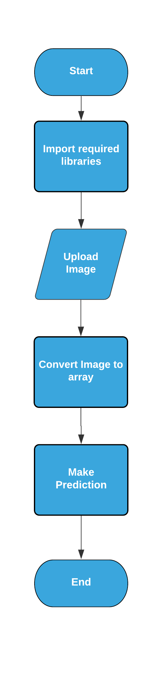

# UCS757 : Building Innovative Systems
# PROJECT 1 : Human emotion detection
## Introduction :
In this project, we are classifying the emotion on a person's face into one of the seven categories, using deep convolutional neural networks. The model is being trained on the FER-2013 dataset which was published on International Conference on Machine Learning (ICML).This dataset consists of 35887 grayscale, 48x48 sized face images with seven emotions - angry, disgusted, fearful, happy, neutral, sad & surprised.

I have trained the model already and i am using the HDF5 file to store the model weights , if you want to train the model please use trainmodel.py file and download the data from the link given below.

## Requirements : 
Python, OpenCV, Tensorflow
## Dataset Source :
https://www.kaggle.com/msambare/fer2013

## Live Link :
https://vishalproject.herokuapp.com/

## Input Interface :

## Input Image :

## Output :

## Flowchart : 

## Submitted by :- 
### Vishal Gulati
### 101803152
### COE8
